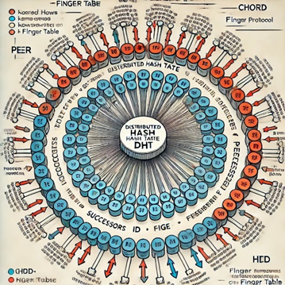
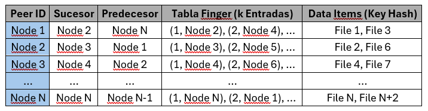
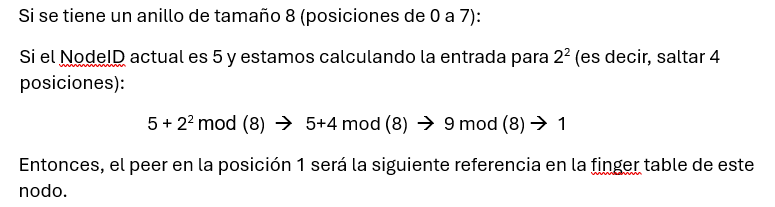
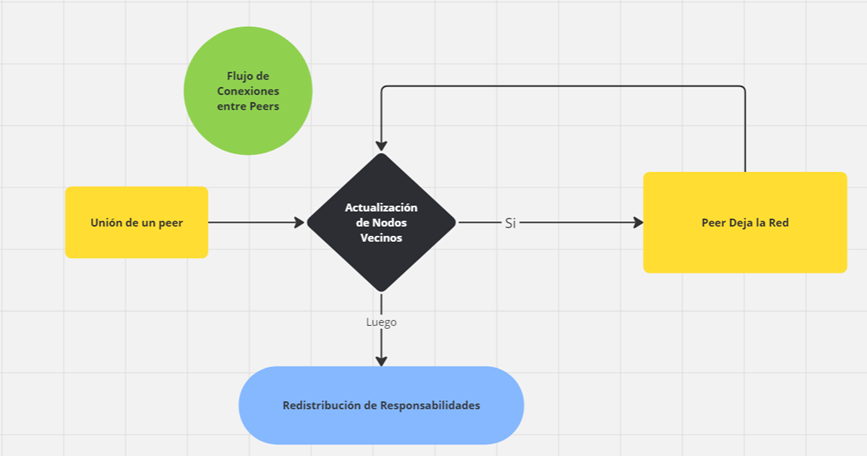
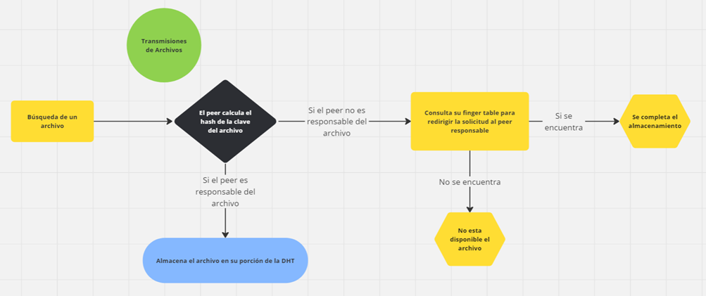

# ST0263 | Tópicos Especiales en Telemática

## Estudiantes: 
- José Manuel Camargo Hoyos | jmcamargoh@eafit.edu.co
- Jose David Valencia Calle | jdvalenci2@eafit.edu.co

## Profesor:
- Juan Carlos Montoya Mendoza | jcmontoy@eafit.edu.co

## Reto #1: Aplicaciones P2P

### 1. Descripción de la Actividad
En esta actividad se realiza el diseño e implementación de un sistema P2P, en el que cada nodo contiene uno o más microservicios para implementar las funcionalidades que soportan un sistema 
de compartición de archivos totalmente distribuido y descentralizado.
En esta versión del reto se implementa una red P2P basada y soportada en una tabla hash distribuida (DHT), utilizando como lenguaje a Java.

#### 1.1. Requerimientos Funcionales y No Funcionales Alcanzados (Propuesta del Profesor)

#### 1.2. Requerimientos Funcionales y No Funcionales No Alcanzados (Propuesta del Profesor)

### 2. Información General de Diseño de Alto Nivel | Arquitectura | Patrones 

## 1. Diseño de la Tabla DHT
Decisión: Usar una Tabla Hash Distribuida (DHT) y no una tabla hash centralizada:
Criterio: La descentralización es clave en sistemas P2P porque queremos evitar puntos únicos de fallo y cuellos de botella en el rendimiento. Al usar una DHT, logramos que la carga de almacenamiento y búsqueda de archivos esté distribuida entre todos los peers. Esto hace que la red sea más escalable y robusta, ya que los peers actúan de forma autónoma para almacenar una parte de los datos.
Justificación: Chord sigue una arquitectura distribuida donde no hay un solo servidor que administre todos los datos. Cada peer se hace responsable de una porción de la tabla hash. Esto también es importante porque facilita la autoescalabilidad: cuando nuevos peers se unen o abandonan la red, solo se redistribuyen las claves que corresponden a esos peers, sin afectar la red completa.
Descripción del flujo:
    •Cada archivo se asocia con una clave hash generada por una función hash (SHA-1).
    •Los peers también tienen una ID hash generada al unirse a la red.
    •La tabla DHT se distribuye basándose en las claves hash de los archivos y los peers.
    •El peer cuya ID es la más cercana (pero mayor o igual) al clave hash del archivo se convierte en el responsable de almacenar el archivo.

Criterio para elegir SHA-1 como función hash:
    •Uniformidad: SHA-1 distribuye las claves uniformemente, lo cual minimiza la posibilidad de que algunos peers almacenen demasiados archivos y otros ninguno.
    •Colisiones mínimas: Si bien SHA-1 no es la función hash más segura para criptografía, sigue siendo apropiada para distribuir claves en sistemas distribuidos, debido a su baja tasa de colisiones en el rango de bits que usamos.
    •Eficiencia: Es una función hash eficiente en términos de tiempo de cómputo, crucial cuando estamos manejando múltiples solicitudes.

Bosquejo del funcionamiento:

Tabla Hash

1.Peer ID: Identificador único del peer en el anillo de la DHT, generado mediante SHA-1. Este valor indica la posición del peer en el anillo hash.

2.Sucesor: El peer que sigue inmediatamente al actual en el anillo. Este peer será responsable de las claves hash que no puedan ser resueltas por el peer actual. Cada peer debe conocer a su sucesor para mantener la consistencia en la red y asegurar que los archivos siempre estén accesibles.

3.Predecesor: El peer que está inmediatamente antes del peer actual en el anillo. Esto es relevante para asegurarse de que la red pueda “auto-repararse” si un peer abandona la red. 

4.Finger Table (k Entradas): Esta tabla contiene referencias a otros peers que están más adelante en el anillo, distribuidos exponencialmente a partir del nodo actual. Esto permite que la búsqueda sea eficiente, ya que se pueden saltar grandes secciones del anillo.
•Cada entrada en la finger table sigue la fórmula:
NodeID + 2^i mod (tamaño del anillo), donde i varía de 0 a (m-1) para un anillo de tamaño 2^m.

•Aplicación del "mod" en Chord:
En el caso de la fórmula NodeID + 2^i mod (tamaño del anillo) en Chord:
1.NodeID es la posición actual del peer en el anillo, basada en su ID hash.
2.2^i representa un salto exponencial (donde i varía de 0 a m-1, siendo m el tamaño del anillo).
3.El tamaño del anillo es el número total de posibles posiciones en el anillo, generalmente 2^m, donde m es el número de bits usados por la función hash (en el caso de SHA-1, serían 2160).

•Por qué usamos "mod" en la fórmula:
El uso de mod en Chord asegura que los valores resultantes de los saltos (NodeID + 2^i) se mantengan dentro del tamaño del anillo. Como el anillo es cíclico, una vez que llegas al valor máximo de posiciones (tamaño del anillo), vuelves a empezar desde cero.

•Ejemplo en un Anillo Pequeño:

5.Data Items (Key Hash): Esta columna almacena los archivos que el peer es responsable de mantener. Los archivos están identificados por el valor hash de su clave (por ejemplo, el nombre del archivo), y se almacenan en el peer cuyo ID es mayor o igual al hash del archivo.

## 2. Diagrama de Flujo de Conexiones entre Peers

Este flujo explica cómo se unen o salen los peers de la red y cómo se actualizan los sucesores y predecesores de los nodos en la red.
Flujo de Conexión:
1.Unión de un peer:
oUn nuevo peer solicita a cualquier peer existente conectarse a la red.
oEl peer existente ayuda al nuevo peer a encontrar su posición en el anillo utilizando la función hash (SHA-1).
oLos peers adyacentes al nuevo peer (su sucesor y predecesor) actualizan sus referencias.
oSe redistribuyen las claves que pertenecen al rango del nuevo peer desde su sucesor.
oEl nuevo peer almacena las claves que le corresponden y se asegura de conocer a su sucesor y predecesor.

2.Actualización de Nodos Vecinos:
oEl peer de contacto notifica a los peers vecinos del nuevo peer para actualizar su sucesor y predecesor.

3.Redistribución de Responsabilidades:
Paso a.El nuevo peer recibe una porción de la DHT de su sucesor.
Paso b.Los archivos clave que ahora caen bajo la responsabilidad del nuevo peer se migran desde el sucesor.

4.Peer Deja la Red:
oEl peer notifica su salida a sus vecinos (sucesor y predecesor).
oEl sucesor del peer que se va asume las claves del peer que abandona la red.
oLos peers adyacentes actualizan sus referencias.

Criterio para evitar puntos únicos de fallo:
•En lugar de que un nodo central coordine las conexiones y salidas, la responsabilidad de gestionar la conexión está distribuida. Esto asegura que la red siga funcionando incluso si varios peers se desconectan inesperadamente.

## 3. Distribución de la DHT
Este flujo describe cómo los peers distribuyen y mantienen la DHT en la red. Siguiendo la estructura de Chord, los archivos se asignan de acuerdo con el hash de su clave.
Decisión: Utilizar tablas finger (finger tables) para mejorar la eficiencia de búsqueda:
Criterio: En redes P2P grandes, la búsqueda secuencial de un archivo puede ser muy lenta. Las finger tables permiten a los peers saltar a lo largo del anillo, logrando que las búsquedas sean más rápidas, reduciendo la latencia de las búsquedas a log(N) en una red de N peers.
Justificación: Aunque podríamos optar por una búsqueda lineal o centralizada, las finger tables son la opción óptima en términos de rendimiento y escalabilidad. Permiten que cada peer tenga una referencia a otros peers distantes en el anillo, lo que acelera las búsquedas y la resolución de solicitudes.

Descripción del flujo:
oAlmacenamiento de un archivo:
1.Un peer recibe una solicitud de almacenar un archivo.
2.El peer calcula el hash de la clave del archivo.
3.Si el peer no es responsable del archivo (según la DHT), consulta su finger table para redirigir la solicitud al peer responsable.
4.El peer que recibe la solicitud de almacenamiento, y almacena el archivo en su porción de la DHT.
oBúsqueda de un archivo:
1.Un peer recibe una solicitud para obtener un archivo.
2.El peer calcula el hash de la clave del archivo.
3.Si el peer no es responsable de la clave, utiliza su finger table para reenviar la solicitud al peer adecuado.

Criterio para elegir finger tables en vez de una tabla completa de referencias:
•Escalabilidad: Mantener referencias a todos los peers de la red es ineficiente a gran escala. En cambio, las finger tables permiten un número reducido de referencias (log(N)), mejorando la eficiencia de la búsqueda sin sobrecargar a los peers con información innecesaria.

## 4. Diagrama de Flujo para Transmisiones de Archivos

Decisión: Uso de transmisión simulada utilizando servicios gRPC en lugar de transmisión real de archivos
Criterio: En esta etapa académica, buscamos implementar la arquitectura y flujo de procesos sin necesidad de transferir archivos reales. Simular la transmisión utilizando un mecanismo de solicitud y respuesta es suficiente para cumplir con los objetivos del proyecto.
Justificación: Implementar una arquitectura distribuida para la transferencia de archivos reales sería más compleja y consumiría recursos innecesarios en esta fase del proyecto. La simulación permite validar el diseño arquitectónico sin los problemas de red y ancho de banda que traería la transmisión de archivos reales.
Flujo de Transferencia de Archivos:
1.Solicitud de Transferencia:
    oUn peer solicita un archivo específico, enviando el hash del archivo a otro peer.

2.Búsqueda del Peer Responsable:
    oSi el peer consultado no es responsable del archivo, utiliza su tabla finger para redirigir la solicitud al peer adecuado.

3.Transferencia Simulada:
    oEl peer responsable del archivo responde a la solicitud y realiza la transferencia (o simula el proceso de envío).

4.Confirmación:
    oUna vez transferido el archivo, el peer receptor confirma la recepción del archivo.

Criterio para simular la transmisión:
    •Simplificación del proyecto: Simular la transmisión reduce la complejidad del proyecto y permite centrarse en los aspectos más importantes, como la distribución de claves, las                conexiones entre peers y la replicación.

## 5. Flujo para Partición y Replicación
Para mejorar la resiliencia y disponibilidad, implementamos partición y replicación. Cada archivo puede particionarse en múltiples fragmentos, y cada fragmento se almacena en varios peers (replicación).
Decisión: Particionar archivos y replicar los fragmentos en múltiples peers (mínimo 2 replicas):
Criterio: La partición de archivos es crucial para manejar archivos grandes y aumentar la eficiencia en la red. La replicación mejora la tolerancia a fallos y la disponibilidad de los archivos en caso de que algunos peers se desconecten inesperadamente.
Justificación: La replicación asegura que, incluso si un peer abandona la red o falla, los archivos aún estarán disponibles desde otros peers. Al particionar los archivos, cada peer almacena solo una pequeña parte del archivo, lo que balancea la carga de almacenamiento y mejora la velocidad de búsqueda y recuperación de datos.
Flujo de Partición y Replicación:
1.Partición:
    oAl almacenar un archivo, se divide en varios fragmentos (usando una técnica como Reed-Solomon).
    oCada fragmento se hashdea y se distribuye a diferentes peers, según la DHT.

2.Replicación:
    oCada fragmento del archivo es replicado en al menos dos peers vecinos en el anillo de Chord para aumentar la tolerancia a fallos.

3.Búsqueda de Fragmentos:
    oAl solicitar un archivo, el peer consulta a la DHT por los fragmentos y los peers responsables.

4.Recuperación:
    oLos peers responsables de cada fragmento son contactados, y los fragmentos son recuperados y reensamblados en el peer solicitante.

Criterio para replicar en dos peers adyacentes:
    •Disponibilidad: Replicar en los peers adyacentes en el anillo de Chord es eficiente, ya que reduce la latencia al no requerir grandes saltos a través del anillo para buscar réplicas.
    •Tolerancia a fallos: Al tener al menos una réplica, el sistema puede soportar que uno de los peers responsables falle sin perder datos.

¿Cómo funciona Reed-Solomon?
Reed-Solomon es un tipo de "algoritmo y/o teorema" de corrección de errores que puede reconstruir archivos o datos bien sean corruptos/perdidos si se conoce un conjunto mínimo de fragmentos. Enfocandolo el contexto de partición y replicación de archivos de nuestro proyecto se estructura así:

1.División del archivo: El archivo original se divide en varios fragmentos de datos.

2.Generación de fragmentos de paridad: Se generan fragmentos adicionales de paridad (o redundancia) a partir de los datos originales mediante operaciones algebraicas. Estos fragmentos pueden utilizarse para reconstruir el archivo incluso si algunos de los fragmentos originales se pierden o corrompen.

3.Reparación de datos: Reed-Solomon permite que si algunos de los fragmentos de datos (ya sean originales o de paridad) se pierden, el archivo se pueda reconstruir utilizando los fragmentos restantes. El número de fragmentos que pueden perderse depende de la configuración del esquema, es decir, cuántos fragmentos de paridad se generaron.

Ejemplo de uso
Si se tiene un archivo dividido en 5 fragmentos y se crean 3 fragmentos de paridad, se pueden perder hasta 3 fragmentos y aún seria posible reconstruir el archivo completo utilizando los fragmentos restantes. Esto es especialmente útil en sistemas distribuidos como redes P2P o sistemas de almacenamiento en la nube, donde los nodos pueden fallar o desconectarse.

### 3. Descripción del Ambiente de Desarrollo y Técnico
- Lenguaje de programación, librerias, paquetes, etc, con sus numeros de versiones.
- *JDK 22.0.2:* https://www.oracle.com/java/technologies/downloads/?er=221886
- *Maven 3.9.9:* https://maven.apache.org/download.cgi
- *Protocol Buffers 3.20.3:* https://github.com/protocolbuffers/protobuf/releases
- Como se compila y ejecuta.
- Detalles del desarrollo.
- Detalles técnicos
- Descripción y como se configura los parámetros del proyecto (ej: ip, puertos, conexión a bases de datos, variables de ambiente, parámetros, etc)
- Opcional - detalles de la organización del código por carpetas o descripción de algún archivo. (ESTRUCTURA DE DIRECTORIOS Y ARCHIVOS IMPORTANTE DEL PROYECTO, comando 'tree' de linux)
- Opcional - si quiere mostrar resultados o pantallazos 

### 4. Descripción del Ambiente de Ejecución (en producción) lenguaje de programación, librerias, paquetes, etc, con sus numeros de versiones.
- IP o nombres de dominio en nube o en la máquina servidor.
- Descripción y como se configura los parámetros del proyecto (ej: ip, puertos, conexión a bases de datos, variables de ambiente, parámetros, etc)
- Como se lanza el servidor.
- Una mini guia de como un usuario utilizaría el software o la aplicación
- Opcionalmente - si quiere mostrar resultados o pantallazos 

### 5. Información Adicional (si se requiere)

### Referencias:
<debemos siempre reconocer los créditos de partes del código que reutilizaremos, así como referencias a youtube, o referencias bibliográficas utilizadas para desarrollar el proyecto o la actividad>
- https://www.youtube.com/watch?v=FLczfVQ7n7o&ab_channel=SaravananSeenivasan
- https://mvnrepository.com/search?q=dht
- https://www.youtube.com/watch?v=TR-otP45eYU&ab_channel=Techtter
- https://os72.github.io/protoc-jar-maven-plugin/index.html
- https://github.com/os72/protoc-jar-maven-plugin
- https://www.xolstice.org/protobuf-maven-plugin/
- https://grpc.io/docs/languages/java/basics/
- https://github.com/RitanMihai/Book-Finder/tree/37bef33df2b1a5b4a2e377ddb024d0dc6ed0fd77
- https://docs.oracle.com/javase/7/docs/api/java/security/MessageDigest.html
- https://pdos.csail.mit.edu/papers/chord:sigcomm01/chord_sigcomm.pdf
- https://www.freecodecamp.org/espanol/news/cadena-de-java-a-int-como-convertir-una-cadena-en-un-numero-entero/
- https://laurel.datsi.fi.upm.es/_media/docencia/cursos/java/2012/guis_en_java-1pp_2012_.pdf
- https://www.teoremas.club/teorema-de-reed-solomon/
- https://es.wikipedia.org/wiki/Reed-Solomon
